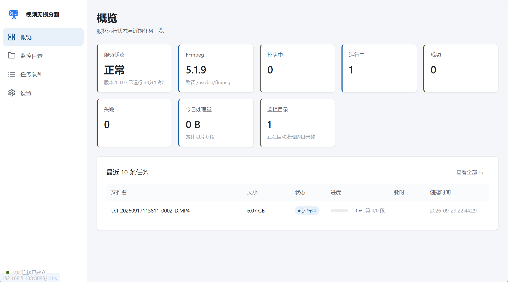
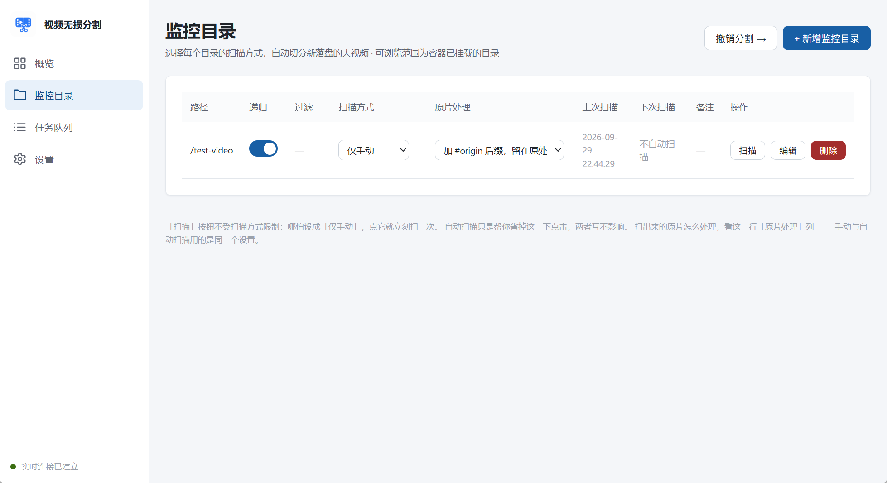
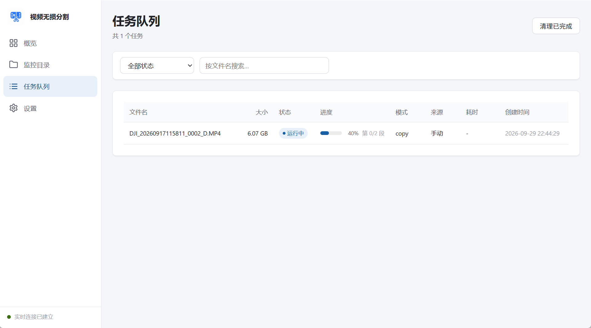
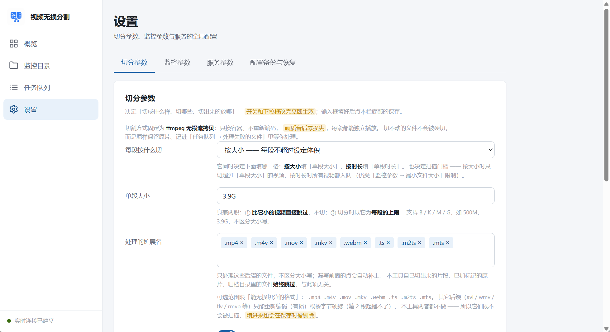

# 视频无损分割 · NAS 版

[](./LICENSE)
[](https://hub.docker.com/r/mawing/video-splitter)


## 简介

把相机、无人机拍出的超大视频切成多段，**全程不重新编码**，画质音质零损失。

加几个监控文件夹，新拷进来的视频会被自动发现并处理；也能按「每隔几小时 / 每天几点」
排定时扫描。所有参数都能在网页上改，给 NAS 用开箱即用。

---

## 功能特性

- **无损切割**：用 ffmpeg `-c copy` 按关键帧对齐切分，只搬字节、不重新编码，
  每段都能单独播放，画质和原片一模一样。
- **全程安全**：切不动的文件**整体失败**——撤掉已生成切片、原片一个字不动，
  原因记进「任务队列 → 处理失败的文件」。宁可什么都不做，也不给你半套坏片。
- **自动监控**：实时监听 + 轮询双保险，网络共享目录（inotify 失效）也不会漏。
- **多种扫描方式**：每个监控目录可选实时 / 每隔几小时 / 每天定时 / 仅手动。
- **文件稳定检测**：确认文件不再被写入才入队，不会切到"半个还在写入的文件"。
- **过滤规则**：按文件类型、文件名 / 文件夹名做「仅限 / 排除」，带命中预览当场对照。
- **撤销分割**：一键把切片删掉、原片改回原名。
- **网页控制台**：一个端口、一个容器，浏览器直接操作，无需 nginx。
- **可选访问密码**：单个密码保护整个网页，无需用户名；不配置时无需密码即可访问。
- **多架构镜像**：Docker Hub 公开镜像支持 amd64 / arm64，`docker pull` 自动选对。
- **命令行版**：`cli/` 下另有一套独立工具（切割 + 撤销），可打包成**免安装
  Python 的单文件可执行程序**，Windows / macOS 双击即用；带 8 步交互式问答，
  选项与网页设置一一对应；支持把常用设置存成预设，跑完还会停住让你看完结果
  再关窗。详见「[命令行版](#命令行版不用-docker也不用装-python)」。

---

## 界面预览

<table>
  <tr>
    <td width="50%"></td>
    <td width="50%"></td>
  </tr>
  <tr>
    <td align="center">概览：服务状态、ffmpeg、任务统计与最近任务</td>
    <td align="center">监控目录：扫描方式、视频数、上次 / 下次扫描</td>
  </tr>
  <tr>
    <td></td>
    <td></td>
  </tr>
  <tr>
    <td align="center">任务队列：进度、失败清单、逐行日志</td>
    <td align="center">设置：切分参数 / 监控参数 / 访问密码</td>
  </tr>
</table>

---

## 快速上手

镜像已在 Docker Hub（`mawing/video-splitter`），不需要自己构建。

### 方式一：docker run（最快）

```bash
docker run -d --name video-splitter -p 8099:8099 \
  -v ./data:/data \
  -v /your/media/dir:/your/media/dir \
  mawing/video-splitter:latest
```

浏览器打开 `http://NAS的IP:8099` 就是控制台。要监控多个目录就再加几行 `-v`，
写法见下方「[挂载多个监控目录](#挂载多个监控目录)」。

### 方式二：docker compose（推荐）

```yaml
# docker-compose.yml
services:
  video-splitter:
    image: mawing/video-splitter:latest
    container_name: video-splitter
    restart: unless-stopped
    ports:
      - "8099:8099"
    environment:
      PUID: 1000        # 非必填。不填就按 root 跑，切片属主是 root，文件管理里不太好改删
      PGID: 1000        # 填你自己的 uid/gid（SSH 里 `id 你的用户名` 查，注意 gid 常 ≠ uid）
      UMASK: "022"
    volumes:
      - ./data:/data                        # 配置与数据库（务必挂载，见下方说明）
      - /your/media/dir:/your/media/dir     # 要处理的视频目录（容器内外路径写一样）
      - /your/other/dir:/your/other/dir     # 有几个目录就写几行，见「挂载多个监控目录」
```

```bash
docker compose up -d
```

#### ⚠️ 配置与数据库文件夹（`./data:/data`）必须挂载

所有状态都保存在容器的 `/data` 目录：切分参数、监控目录列表、数据库、任务历史、
失败清单。**务必挂成一个宿主机目录或 Docker 卷。**

**不设置的风险**：`/data` 会落在容器的可写层（临时层）里。一旦容器重建、升级镜像，
这部分数据就**全部清零**——监控目录要重新添加、设置回默认值、任务历史全没。
所以 `./data:/data` 这一行要保留。

PUID / PGID / UMASK 则**不是必须**（默认 `0 /0 /022`，按 root 跑），
唯一影响是切出来的文件属主，想文件归你管才填。

起来后左侧导航四项：**概览** / **监控目录** / **任务队列** / **设置**。

### 完整上手流程（从零到自动切分）

上面 compose 里的挂载只是第一步。从「拷视频进去」到「自动切好」一共 5 步，
每步一句话；细节都在各自链接过去的小节里，遇到问题再翻。

1. **在 Docker 里加存储位置** —— 网页能浏览哪些文件夹完全由挂载决定，一行一个目录、容器内外路径写一样（见[挂载多个监控目录](#挂载多个监控目录)）。
2. **打开控制台** —— 浏览器访问 `http://NAS的IP:8099`，配了 `VS_ACCESS_PASSWORD` 会先要求输密码。
3. **定切割参数** —— 进「设置 → 切分参数」，默认的「按大小 3.9G + 原片移进归档子目录」适合大多数人，确认这两项就够。
4. **添加要盯的文件夹** —— 进「监控目录 → 新增」，选中第 1 步挂进来的目录，挑一种扫描方式（实时监听 / 定时 / 仅手动），过滤规则可留空、且选完路径后下方「命中预览」能当场验证写得对不对。
5. **拷一个大视频进去验证** —— 拷贝过程中不会动手（文件要连续 60 秒不变才认定写完，见[文件稳定检测](#网页设置页)），之后到「任务队列」看它从 排队中 → 运行中 → 成功。

之后想反悔或遇到失败：

- **切错了想还原**：监控目录 → 撤销分割，一键把切片删掉、原片改回原名。
- **有文件切不动**：不会碰坏原片——已生成的切片撤掉、原片一个字节不动，原因记进任务队列顶部的「处理失败的文件」；文件更新后会自动重试，不用手动清记录。

---

## 命令行版（不用 Docker，也不用装 Python）

除了网页控制台，`cli/` 下还有一套独立的命令行工具，用的是**同一套无损切割引擎**
（DJI 附加流、元数据回写这些坑都踩过了），适合「就切一次」「写进脚本定时跑」
这类场景：

| 工具 | 作用 |
|------|------|
| `video_splitter` | 扫描目录、无损切分、标记原片 |
| `undo_split` | 撤销分割：删掉切片、原片改回原名 |

### 下载

去 Release 页下载对应平台的产物，双击即用，**目标机器不需要装 Python**：

**⬇ https://github.com/hellomawing/resize-video-auto/releases/latest**

| 平台 | 下这个 |
|------|--------|
| Windows | `video_splitter-windows-x64.exe`、`undo_split-windows-x64.exe` |
| macOS | `video_splitter-macos-arm64` / `-x86_64`（Apple 芯片 / Intel 各一份） |

拷到任何一台同系统的电脑上双击就能跑，也可以把文件夹拖到它图标上（等价于命令行给路径）。
`cli/run_splitter.bat`（Windows）/ `cli/run_splitter.command`（macOS）是两个启动器，
双击它们效果一样。

> **Release 里没有 macOS 版？** PyInstaller 不支持交叉编译——macOS 的二进制只能在
> Mac 上打，所以那一栏可能暂时是空的。在自己 Mac 上跑一次 `python cli/build_exe.py`
> 就有了（见下）。

### 没有现成产物时：自己打包 / 直接用 Python

**自己打包**（装一次 Python，产物给谁用谁就不用装了）：

```bash
pip install -r cli/build-requirements.txt
python cli/build_exe.py              # 单文件，产物在 cli/dist/
python cli/build_exe.py --onedir     # 目录版，启动快一个数量级
```

- **单文件还是目录**：单文件只有一个文件、拷来拷去最省事，但每次运行都要把自己解压
  到临时目录、退出时再删掉，本机实测启动约 13 秒；`--onedir` 没有这个开销，约 1 秒。
  打包脚本里有个自定义 hook 把 Tcl/Tk 用不上的数据裁掉了（文件数 926 → 172，
  这段耗时从约 50 秒降到约 13 秒）。
- ⚠️ 打包用的 Python **必须自带 tkinter**，否则产物里没有图形化文件夹选择框
  （向导第 1 步回车弹不出窗口，只能手动粘路径）。`build_exe.py` 会提前检测并警告。
  Windows 用 python.org 官方安装包即可；macOS 需要 `brew install python-tk`。
- ⚠️ 要在哪个平台用，就在哪个平台上跑一次 `build_exe.py`。

**直接用 Python 跑**（本机已经有 Python 3）：

```bash
python cli/video_splitter.py            # 交互向导
python cli/video_splitter.py D:\Videos  # 直接处理
```

> **macOS 用户注意**：别指望「Mac 自带 Python，不用打包」。macOS 从 **12.3** 起就
> 不再附带 Python 2.7；`/usr/bin/python3` 虽然还在，但按
> [Python 官方文档](https://docs.python.org/3/using/mac.html)的说法，它指向的是
> 「Apple 给开发工具（Xcode / 命令行工具）准备的那一份，通常偏旧且不完整」，
> 而且在没装命令行工具的机器上执行它会弹出「安装命令行开发者工具」对话框
> （约 1.5G 下载）。
>
> `cli/run_splitter.command` 已经处理了这件事：它会跳过这个占位程序，优先找
> Homebrew（`/opt/homebrew/bin`、`/usr/local/bin`）、python.org 安装包、pyenv 里的
> 真 Python；一个都没有就明确提示你去用打包好的产物。

### 跑完不会立刻关窗

双击可执行文件时，控制台窗口会在程序退出的一瞬间消失，根本来不及看结果。
所以工具会在结束前停住，让你先看完输出：

- **双击启动**：自动停下，显示「运行结束」和一个日志文件路径，按回车才关闭。
- **从终端里跑**（cmd / PowerShell / Terminal）：不停，历史输出本来就翻得到。
- 想强制打开或关掉：`--pause` / `--no-pause`。

判断「是不是双击」用的是控制台进程数和父进程链两条依据（打包成 onefile 后是
「引导进程 + 真身进程」两个同名进程，只看进程数会失灵，所以还看了父进程是不是
`explorer.exe`）。输出被重定向到管道或文件时不会停——那种场景没人在窗口前等，
停下来只会把脚本卡住。

> 单文件版按下回车后，窗口可能还要再卡十几秒才关：那是在删运行时解压出来的
> 临时文件（见上面「单文件还是目录」）。用 `--onedir` 打包就没有这段。

### 交互模式：8 步，和网页设置一一对应

不带任何路径直接运行就进入问答向导，每步回车用推荐值，输入 `q` 随时取消。

| 步骤 | 问什么 | 对应网页里的 |
|------|--------|--------------|
| 1 | 要处理的文件夹 | 监控目录的路径 |
| 2 | 按大小切 / 按时间切、具体数值 | 设置 → 切分参数 |
| 3 | 处理哪些格式、最小体积 | 设置 → 处理的扩展名 ／ 监控 → 最小体积 |
| 4 | 过滤规则（文件名与文件夹名，仅限 / 排除） | 监控目录 → 过滤规则 |
| 5 | 切片输出位置（原片旁边 / 指定目录） | 设置 → 输出目录 |
| 6 | 原片怎么处理、归档文件夹叫什么 | 设置 → 原文件处理方式 |
| 7 | 子文件夹、覆盖已有切片、保留元数据 | 设置 → 切分参数 |
| 8 | 先预览一遍、输出调试信息 | 设置 → 调试 |

最后会打一张汇总表让你过目。第 8 步选了「先预览」的话，会先把整件事走一遍但
**不写任何文件**，列出每个文件会切成几段、落在哪、原片怎么处理；确认无误后再
回车才真正执行。

确认设置之后、真正开始切割之前，还会顺口问一句**要不要把这套设置存成预设**
（存成新预设，或者覆盖你刚套用的那个）。这一步被刻意放在「参数还在眼前」的
时候问——等切完再问，人已经在等结果了，多半随手跳过。

### 预设：把常用设置存下来

预设存在程序旁边的 `presets.json` 里（和日志、自装的 ffmpeg 同一套规则，整个
工具始终是「一个目录，拷走就能用」）。

```bash
# 把命令行上这套设置存下来，存完即退出（不切割、不进向导）
python cli/video_splitter.py --save-preset "无人机素材" \
    --size 2G --ext .mp4 --name-include 相机 --mark-source move

# 列出 / 删除
python cli/video_splitter.py --list-presets
python cli/video_splitter.py --delete-preset "无人机素材"

# 套用：向导只会再问一句「要处理哪个文件夹」，其余 7 步全跳过
python cli/video_splitter.py --preset "无人机素材" -i

# 也可以不带参数跑，向导开头会列出所有预设让你挑序号
python cli/video_splitter.py
```

**命令行参数优先于预设**：`--preset 无人机素材 --size 5G` 里那个 `5G` 会生效，
预设只是省事的默认值，不是枷锁。反过来，预设里 `--ext-exclude` 之类的空值不会
把命令行上显式给的值盖掉。

### 过滤规则怎么用

与网页版同一套口径：比对的是**文件 / 文件夹的完整名字（含扩展名）**，以及该
文件到所选目录之间**各级文件夹的名字**。所以一条规则能同时管到文件名和上层
目录名：

| 规则 | 会命中 |
|------|--------|
| 仅限 `相机` | `相机导入/2026/a.mp4`（父目录名命中）、`其他/相机花絮.mp4`（文件名命中） |
| 仅限 `re:^DJI_\d{4}\.mp4$` | 只有 `DJI_0002.mp4`（**别忘了把扩展名算进去**） |
| 排除 `_proxy` | 任何名字带 `_proxy` 的文件或文件夹（整个文件夹会被跳过，不白扫） |

- 「包含」不区分大小写；以 `re:` 开头按正则（要忽略大小写写 `(?i)`）。
- **排除优先于仅限**：两边都命中时一律排除。
- 一行里可以用逗号写多条；正则里真要写逗号就用 `\,` 转义。
- 被规则挡下的文件会汇总成一行「按过滤规则跳过 N 个文件（原因×N）」，不会
  静悄悄少掉——否则你只会看到「0 个视频」然后开始怀疑扫描坏了。

```bash
python cli/video_splitter.py D:\Videos --name-include "相机" \
    --name-exclude "_proxy,re:\.bak$" --min-size 200M --outdir D:\切片
```

### 常用参数

| 参数 | 说明 |
|------|------|
| `-s, --size` | 每片体积上限，默认 `3.9G`（FAT32 安全值） |
| `-t, --seconds` | 按时间切，每片秒数（`300` = 5 分钟） |
| `--all` | 不按体积筛选，扫到的都切 |
| `--ext` | 要处理的扩展名，逗号分隔（等价于网页的「处理的扩展名」） |
| `--name-include` / `--name-exclude` | 名字过滤规则，见上 |
| `--ext-exclude` | 排除某些扩展名 |
| `--min-size` | 小于该体积的文件直接忽略 |
| `-o, --outdir` | 切片输出目录，默认与原片同目录 |
| `--mark-source` | `rename`（默认，加 `#origin`）／ `move` ／ `none` |
| `--source-dir` | `move` 时的归档文件夹名 |
| `--delete-source` | 切完删原片（会二次确认） |
| `-n, --dry-run` | 只预览不写文件 |
| `--overwrite` | 覆盖已存在的切片 |
| `--debug` | 输出 ffmpeg 完整命令、流布局、每段码率明细 |
| `--install-ffmpeg` | 缺 ffmpeg 时自动下载安装到程序旁边 |
| `--pause` / `--no-pause` | 强制「结束前停住等回车」/ 强制不停（默认自动判断） |
| `--preset` / `--save-preset` | 套用 / 保存预设，见上 |
| `--list-presets` / `--delete-preset` | 列出 / 删除预设，做完即退出 |

`--help` 有完整列表。运行日志默认写在程序旁边（`video_splitter_log.txt`），
不想要就加 `--no-log`。

### 撤销分割

```bash
python cli/undo_split.py D:\Videos         # 预览，只看不动
python cli/undo_split.py D:\Videos --yes   # 确认后执行
```

默认是预览模式。执行前会逐个校验「删掉这些切片会不会丢数据」（比对切片时长之和
与原片时长），不通过就一个切片都不删；原片改回原名时若目标名已被占用会跳过并
报告，绝不覆盖。

两种原片归档形式都会正确处理：

| 分割时的 `--mark-source` | 目录里长什么样 | 撤销时做什么 |
|---|---|---|
| `rename`（默认） | `DJI_001#origin.mp4` 与切片同目录 | 原地改回 `DJI_001.mp4` |
| `move` | `resize-video-origin-file/DJI_001.mp4` | **搬回上一级目录**（不是只改个名就完事） |

历史版本的归档目录叫 `origin/`，现在叫 `resize-video-origin-file/`，
`undo_split` 两个名字都认，老目录里的原片一样能回退。如果你的归档目录名是自
定义的，用 `--source-dir 你的目录名` 告诉它。

---

## 设置和配置说明

### 网页「设置」页

| 项 | 说明 |
|----|------|
| 分割 | 按大小或按时长切、切多段、支持哪些扩展名、原片怎么处理（保留 / 移走 / 删除） |
| 监控 | 实时监听、轮询间隔、文件稳定检测时长、忽略临时文件后缀 |
| 过滤规则 | 每目录可配「仅限 / 排除」，按文件类型 / 文件名 / 文件夹名筛选 |
| 服务参数 | 只读的数据目录、运行身份等信息 |
| 访问密码 | 设置 / 修改 / 关闭访问密码（详见下） |

**访问密码（可选）**：设置一个后，打开网页需要先输入密码才能操作，单个密码、不需要用户名。

- **不设置时无需密码即可访问**。如果这台 NAS 暴露在公网上（端口映射 / frp / 隧道等），
  建议配置，否则任何人都能浏览、改名、删除你的文件。
- 两种配置途径：网页「设置 → 访问密码」，或部署时的环境变量 `VS_ACCESS_PASSWORD`。
- 网页里**设置或更新密码后，会立即跳回登录页要求重新登录**（旧会话已失效）。
- 优先级：**环境变量 > 网页设置**。配了环境变量后，网页上改不了也关闭不了——要改只能
  改部署的 environment 后重建容器（避免网页和部署层各压一个密码、说不清谁生效）。
- **`VS_ACCESS_PASSWORD` 同时是复位手段**：每次容器重启时，环境变量密码会自动覆盖
  并把网页密码更新成它。忘了网页密码？配一个环境变量重启即可，网页密码就被重置成
  这个值；之后想回到网页管理，把环境变量去掉再重启。

**核心机制——文件稳定检测**：在 PC 上往 NAS 拷一个 20GB 文件要十几分钟，如果文件
一出现就切分，会切到"半个还在写入的文件"。所以文件先证明自己不再被写入才入队：
修改时间超过 `settleSeconds` 秒没更新，或文件大小连续 `settleSeconds` 秒没变化
（默认 60 秒，网络共享目录慢可调大）。

**扫描方式**（每目录可选一个）：实时监听 / 每隔几小时 / 每天定时 / 仅手动。
按时间触发的计划用容器内时区，所以 `.env` 里 `TZ` 要填对。

### Docker 配置（compose）

主要需要调整的就几项：端口（`VS_PORT` / 左边 `"8099:8099"`）、时区（`TZ`）、
文件属主（`PUID` / `PGID`）、访问密码（`VS_ACCESS_PASSWORD`，可选）。其余保持默认即可。

#### 挂载多个监控目录

网页上能浏览、能添加监控的范围**完全由挂载决定**——有几个监控目录，`volumes` 里就
写几行；之后到「监控目录 → 新增」逐个添加即可。每个目录的扫描方式（实时 / 定时 /
手动）、过滤规则、原片处理方式都是各自独立的，互不影响。

```yaml
volumes:
  - ./data:/data                                        # 配置与数据库，必须挂
  # 监控目录：一行一个，容器内外路径写成一样
  - /vol1/1000/视频/待处理:/vol1/1000/视频/待处理
  - /vol1/1000/无人机素材:/vol1/1000/无人机素材
  - /vol1/1000/相机原片:/vol1/1000/相机原片
  # 切片集中输出目录（设置里输出目录指向它时才需要，也要挂进来）
  - /vol2/1000/切片输出:/vol2/1000/切片输出
```

`docker run` 同理，一个目录一个 `-v`：

```bash
docker run -d --name video-splitter -p 8099:8099 \
  -e PUID=1000 -e PGID=1000 -e TZ=Asia/Shanghai \
  -v ./data:/data \
  -v /vol1/1000/视频/待处理:/vol1/1000/视频/待处理 \
  -v /vol1/1000/无人机素材:/vol1/1000/无人机素材 \
  mawing/video-splitter:latest
```

几个容易踩的点：

- **容器内路径和宿主机保持一致**（两边写一样）。写成 `...:/media` 也能跑，但任务记录、
  撤销分割、去重都按**容器内路径**落库；之后想把挂载名改回去，历史记录就全对不上了。
- **同一父目录下的多个子目录，挂父目录一次就够**。比如
  `/vol1/1000/视频/{待处理,已完成,归档}` 三个都在 `/vol1/1000/视频` 下，只挂
  `- /vol1/1000/视频:/vol1/1000/视频` 一行，再在网页上分别添加三个子目录。
  反过来注意：别把父目录和它的子目录**同时**加为监控目录——不会重复切（同一文件
  重复入队会被挡住），但会白扫一遍，视频计数也会虚高。
- **保持读写，别加 `:ro`**。原片处理方式选「改名 / 移进子目录 / 删除」都要写原目录，
  「撤销分割」也要改原片名。只读挂载只适合「原片不动 + 切片输出到另一个目录 +
  永不撤销」这种窄场景。
- **别挂不存在的宿主目录**。Docker 会自动建一个 root 属主的空目录，现象是
  「能看见但读不了」，很容易被误判成权限 bug。
- **路径含空格或中文时加引号**：`- "/vol1/1000/我的 视频:/vol1/1000/我的 视频"`。
- **PUID / PGID 要填对**（SSH 里 `id 你的用户名`，注意 gid 常 ≠ uid）。填错的表现是
  网页能看见目录、但切片写不进去。
- ⚠️ **不要挂整盘（如 `- /vol1:/vol1`）**：这个网页默认没有登录鉴权，挂整盘等于
  把同网段任何人都能浏览、改动主机用户文件的范围交出去。
  如果确实需要暴露到公网，请务必配上 `VS_ACCESS_PASSWORD`。

---

## 感谢这些开源项目

本项目建立在以下卓越的开源项目之上，衷心感谢它们的贡献：

| 项目 | 用途 |
|------|------|
| [FastAPI](https://github.com/tiangolo/fastapi) | Web 框架，原生支持 async WebSocket 推送实时进度与日志 |
| [Uvicorn](https://github.com/encode/uvicorn) | ASGI 服务器 |
| [Pydantic](https://github.com/pydantic/pydantic) | 数据校验与模型（camelCase 出入参） |
| [APScheduler](https://github.com/agronholm/apscheduler) | 定时扫描任务调度 |
| [watchdog](https://github.com/gorakhargosh/watchdog) | 目录实时监听（Linux 走 inotify） |
| [ffmpeg](https://ffmpeg.org/) | 无损流拷贝切割核心（GPL/LGPL） |
| [Vue 3](https://vuejs.org/) | 网页控制台前端框架 |
| [vue-router](https://router.vuejs.org/) | 前端路由 |
| [Vite](https://vitejs.dev/) | 前端构建工具 |
| [TypeScript](https://www.typescriptlang.org/) | 类型安全的工程化前端 |
| [gosu](https://github.com/tianon/gosu) | 容器内从 root 降权到 PUID/PGID 指定用户 |
| [Node.js](https://nodejs.org/) / [Python](https://www.python.org/) | 前端 / 后端运行环境基础 |

---

## 许可

本项目以 **MIT** 协议开源，详情见 [LICENSE](./LICENSE)。

Copyright (c) 2026 CoderDusk <hellomawing@gmail.com>